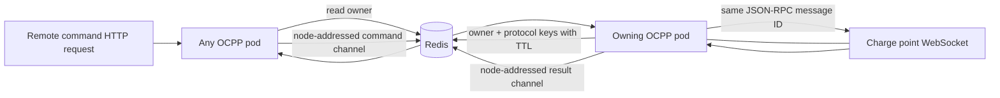

# ADR-001: Distributed OCPP WebSocket ownership and command routing

- Status: Accepted for staged rollout
- Date: 2026-08-06
- Scope: OCPP service high availability only

## Problem

An OCPP WebSocket is stateful and terminates on one service pod. HTTP remote-command requests are load balanced independently and can reach a different pod. A process-local session map therefore cannot reliably deliver `RemoteStartTransaction`, `RequestStartTransaction`, `SetChargingProfile`, or other commands once the service has more than one replica. A normal rolling restart also closes sockets without first removing the pod from service or telling chargers to reconnect.

The solution must preserve the existing OCPP 1.6J and 2.0.1 behavior, durable remote-start idempotency, original JSON-RPC message IDs, internal-service authentication, and single-replica fallback.

## Invariants

1. Exactly one Redis owner marker is authoritative for a charge point at a time.
2. Only the pod that owns the marker may write commands to that charge point's socket.
3. The original OCPP JSON-RPC message ID crosses the pod boundary unchanged.
4. A command is never silently rerouted or replayed after its owner disappears. The caller receives a route failure or timeout and existing reconciliation rules apply.
5. Removing an old socket must not delete a newer pod's owner marker.
6. Production remains on one replica with routing disabled until the two-replica development rollout passes.
7. A draining pod refuses new WebSocket handshakes and HTTP readiness traffic before its existing sockets are closed with WebSocket status 1012.

## Design

Redis keys:

- `ocpp:connection:{chargePointId}` -> owning pod ID, TTL 120 seconds by default.
- `ocpp:protocol:{chargePointId}` -> `OCPP16J` or `OCPP201`, with the same TTL.

Channels:

- `ocpp:node:commands:{ownerNodeId}` carries a command ID, origin node, charge point, action, payload, original message ID, and request time.
- `ocpp:node:results:{originNodeId}` carries the terminal payload or failure.

Owner deletion and TTL refresh use compare-and-delete/compare-and-refresh Lua scripts. This prevents a stale connection from removing or extending the route created by a newer connection. Redis Pub/Sub is intentionally non-durable: live WebSocket commands must not be replayed after a pod failure because delivery state would be ambiguous.

Cluster routing is controlled by `OCPP_CLUSTER_ROUTING_ENABLED` and defaults to `false`. A listener container is created only when it is enabled.

## Graceful drain

The pod pre-stop hook calls `POST /api/v1/ocpp/internal/drain` with the existing internal service token. The service then:

1. rejects new handshakes;
2. publishes `REFUSING_TRAFFIC` readiness;
3. remains alive during the pre-stop delay so in-flight routed commands can finish;
4. closes remaining sockets with status 1012 during shutdown, prompting charger reconnect;
5. removes only owner markers still belonging to that pod.

Development uses two replicas and a PodDisruptionBudget with `minAvailable: 1`. Production initially receives only the safe drain behavior; two replicas and routing are enabled only after development acceptance.

## Failure behavior

| Failure | Expected behavior |
|---|---|
| No owner marker | Return charge-point-not-connected |
| Remote owner and routing disabled | Return route-unavailable; do not claim success |
| Redis unavailable or ownership indeterminate | Fail closed; do not write a command to an unverified socket |
| Owner disappears after route lookup | Return route failure or timeout; do not replay |
| Result arrives after caller timeout | Ignore it and increment the late/unknown path metric |
| Rolling restart | Readiness drops first; sockets reconnect with charger backoff after 1012 |

## Security boundary

The drain endpoint and command endpoints remain protected by `X-ElectraHub-Internal-Token`. Redis must remain network-private and authenticated by the platform configuration. Charger authentication, strict WebSocket origins, and OCPP security profiles are a separate security stage and are not silently mixed into this availability release.

## Rollout and rollback

1. Run all unit and Spring integration tests.
2. Publish one immutable OCPP image from `develop`.
3. Deploy that image to development with two replicas, routing enabled, PDB enabled, and graceful drain.
4. Validate health/readiness, owner keys, cross-pod command delivery, original message-ID correlation, reconnect behavior, and existing session flows.
5. Deploy the exact validated image to production with routing disabled and one replica; validate existing behavior and drain readiness.
6. Enable two production replicas and routing only in a separate GitOps commit after the production-safe binary is healthy.

Rollback is configuration-first: disable routing and return to one replica without reverting the compatible binary. If binary rollback is necessary, restore the preceding immutable image tag. Redis keys expire automatically and do not require a data migration.

## Acceptance criteria

- Full Maven suite passes.
- Two development pods are Ready and the PDB is effective.
- A command sent to a non-owner pod reaches the owner and returns the charger response.
- Durable remote-start correlation keeps the same OCPP message ID across pods.
- An offline or indeterminate charger never reports command success.
- Draining one pod does not make the service unavailable; connected simulators reconnect and resume heartbeats.
- Existing start, meter, stop, receipt/session callback, and remote-command smoke tests pass in development and production.
- No new error-rate, reconnect-storm, command-timeout, or session-success regression is observed during the validation window.

